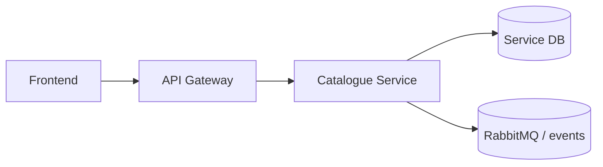

# Software Architecture

## Responsibility

Product listing lifecycle, marketplace search/filter, seller listing management, category resolution, bid-state projection, and listing expiry reconciliation.

## Integration Surface

`/api/v1/catalogue/listings/**`, search, create/update, publish, deactivate/cancel, admin close, and bid-state sync endpoints.

## Platform Position

## State and Consistency

Listing state is stored in PostgreSQL; lifecycle transitions are guarded by state objects and service-level validation.

## Cross-Service Contract

The gateway and event bus are the only supported cross-service entry points. Downstream consumers must tolerate additive optional fields, while existing required fields and routing keys remain stable.
