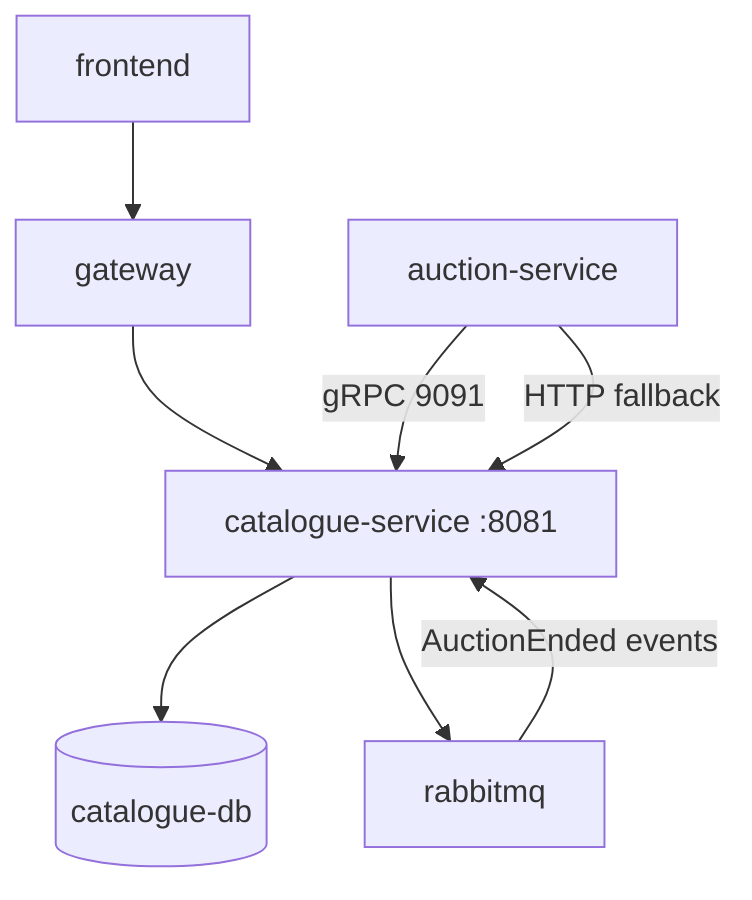

# Software Architecture

## Integrations

| Partner | Protocol | Purpose |
|---------|----------|---------|
| API Gateway | HTTP REST | Public listing CRUD, search |
| Auction service | gRPC + HTTP | Listing summary, eligibility checks |
| RabbitMQ | AMQP | Consume auction lifecycle events |
| PostgreSQL | JDBC | Listing/category persistence |

## Event-driven sync

When auction closes, auction module publishes events; `AuctionCatalogueEventConsumer` marks listings `SOLD` / `UNSOLD` accordingly. Exchange: `BIDMART_EVENTS_EXCHANGE` (compose env).

## Dual API surface

- **REST** — frontend and gateway (`/api/v1/listings`).
- **gRPC** — low-latency internal reads (`CatalogueGrpcService`, proto under `src/main/proto/`).

## Observability

- Prometheus: `catalogue-service:8081/actuator/prometheus`
- Scrape config: `bidmart-infrastructure/monitoring/prometheus/prometheus.yml`
